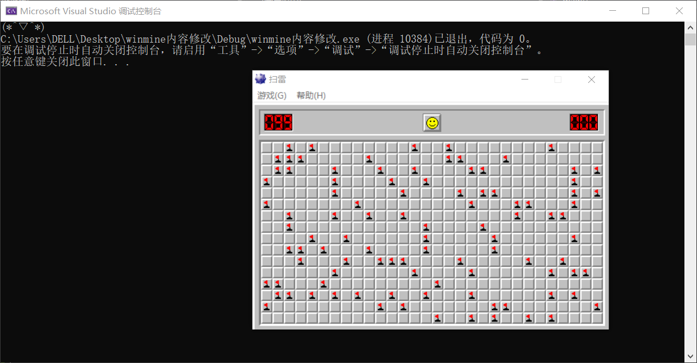

# winmine内容修改
### 对xp版扫雷进行内容修改，做到瞬间标记雷区
## 1 计时器置0
### 通过挂载扫雷游戏，找到内存中保存时间的地址和对应控制语句。发现两条相关语句，第一条语句代表游戏的最大时限是999s(超过999s游戏失败)，第二条控制时间的增加。要实现计时器置零就要让第二条语句失效，把对应位置六个字节的代码全变成0x90，使第二条语句变成什么都不执行的nop语句。因为扫雷开始后从1秒开始计时，所以还需要将保存时间的内存数据修改为0，否则就悬停在1s上了。
### 扫雷游戏还存在一个机制，第一次点击方块时，时间强制变为1，同样挂载，设断点，找到相关语句，将其变成nop语句。
## 2 标记雷区
### 在扫雷游戏中，程序初始化时会进行雷区的分布（开局），但点开一个方块后，雷区又会重新分配（鼠标点击到松开的瞬间）；但当开局的第一个操作是标记红旗（鼠标右键），而不是点开方块（鼠标左键）时，游戏的雷区就会在初始化时确定，不会再重新分配。即：标记第一个红旗后再点开一个方块，雷区就不会重新分配了。这是能够做到标记全部炸弹的基础。第一个点击的方块的行和列会被保存在寄存器里面。分析基地址中的内容，会发现一个被10围出的矩形区域，并且雷区中的数字用ASCII码表示，炸弹用0x8F表示，被标为小红旗的方块会用0x8E在内存中进行标记
### 因此实现标记雷区的功能，首先要获取整个雷区的内存数据，将其中的0x8F（炸弹）标注为0x8E（小红旗），最后写入并刷新
